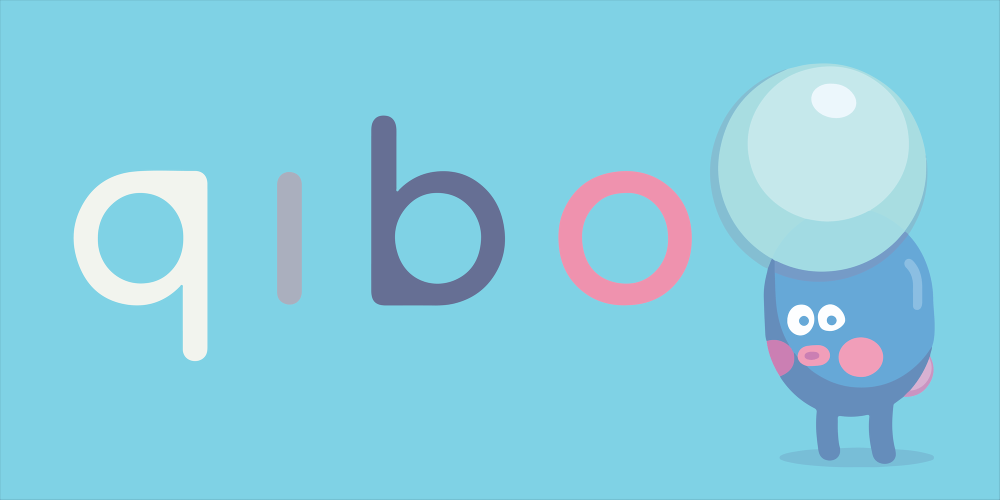

# Qibo, tell me why

Welcome! Qibo is a unique and innovative educational app that helps young children (ages 2-6) explore and learn about the world around them. With Qibo, children and their parents can get answers to any "Why?" questions in a fun and accessible way.

Qibo features a friendly and approachable character, who is able to provide accurate and appropriate answers to any questions asked. The app uses speech-to-text technology to process user questions and text-to-speech technology to provide spoken answers, and is integrated with an AI language model — based on Open AI's latest GPT3 advancements — to generate unique responses.

> Note this is **not** the code repository for the Qibo application.
> This code repository is the source for the https://askqibo.com/ website.

## Illustration credits and copyrights

### Meet Qibo!

The Qibo brand and logo are the intellectual property of [Unstatic Labs](https://unstaticlabs.com), created by Valentin Viennot and Roget Miret Giné ((c) 2022-2023).

### Illustrations

All original illustrations featured in the Qibo app and websites are the intellectual property of Unstatic Labs and its creators.

All non-original illustrations are licensed under CC BY terms:

- **The Qibo character and animation is the creation of [Kirill Meshkov](https://twitter.com/moonk) ([rockingelevator](https://rive.app/@rockingelevator/)), named "[Quiz Time](https://rive.app/community/3686-7699-quiz-time/)" and licensed under [CC-BY 4.0](https://creativecommons.org/licenses/by/4.0/).**
- Other animations from [Kirill Meshkov](https://twitter.com/moonk) ([rockingelevator](https://rive.app/@rockingelevator/)) licensed under [CC-BY 4.0](https://creativecommons.org/licenses/by/4.0/) are being used in the Qibo app: [Pathfinder](https://rive.app/community/3902-8169-pathfinder/), [Impatient Placeholder](https://rive.app/community/2492-5015-impatient-placeholder/), [Milkshake bomb](https://rive.app/community/1242-2394-milkshake-bomb/).
- Icons are licensed under [CC-BY 3.0](https://creativecommons.org/licenses/by/3.0/) from [The Noun Project](https://thenounproject.com/):
    - "[Alert](https://thenounproject.com/icon/alert-5386525/)", by [Aurel](https://thenounproject.com/garudaindonesia970/)
    - "[Dice](https://thenounproject.com/icon/dice-1765632/)", by [Andy Ivandikov](https://thenounproject.com/andy6556/)
    - "[Gem](https://thenounproject.com/icon/gem-1215009/)", by [Andri Widodo](https://thenounproject.com/andriwidodo21/)
    - "[Keyboard](https://thenounproject.com/icon/keyboard-4791432/)", by [FR Icons](https://thenounproject.com/fr-icons/)
    - "[Microphone](https://thenounproject.com/icon/microphone-730104/)", by [Maxim Kulikov](https://thenounproject.com/maxim221/)
    - "[Paper Plane](https://thenounproject.com/icon/paper-plane-4450394/)", by [Lufti Gani Al Achmad](https://thenounproject.com/lutfidiarycoc/)
    - "[Thumb](https://thenounproject.com/icon/thumb-2286698/)", by [Travis Avery](https://thenounproject.com/travisavery/)

## Community and Support
We welcome your feedback and ideas for Qibo. If you have any issues with the app or suggestions for new features, please don't hesitate to open an issue on our GitHub repository. You can also join the discussions with other Qibo users and stay updated on the latest developments by visiting the "Discussions" section of the repository.

## Roadmap and Change Log
You can find out more about our plans for the future of Qibo and track the changes we make to the app by visiting https://askqibo.com/.

## Contact Us
If you have any questions or concerns about Qibo, don't hesitate to contact us either on here or at contact@askqibo.com. We're always happy to help.